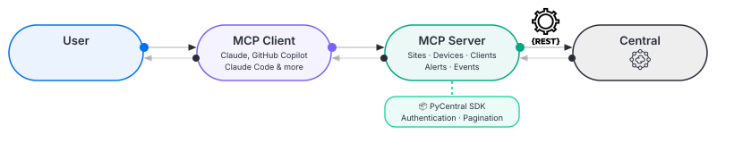

# central-mcp-server

Community MCP server for HPE Aruba Networking Central, packaged as a Docker container. This exposes your Central data as tools that AI assistants can query directly.

---

> [!WARNING]
> **Unofficial Community Project**
>
> This is **not** an officially supported product of HPE. It is provided as-is, with no warranty or guarantee of fitness for any purpose.
>
> - Review your organization's **corporate device and data policies** before connecting this server to any AI assistant.
> - **Never share credentials** (API secrets, API keys) with AI model providers unless your security policy explicitly permits it.
> - All read operations query live data from your HPE Aruba Networking Central instance. Recommended to test MCP server use in non-production or lab environments where possible before running on production.

---

## Table of Contents

- [Overview](#overview)
- [Prerequisites](#prerequisites)
- [Getting Your Credentials](#getting-your-credentials)
- [Quick Start](#quick-start)
- [MCP Client Configuration](#mcp-client-configuration)
- [What You Can Ask](#what-you-can-ask)
- [Container Management](#container-management)
- [Dev Setup](#dev-setup)

---

## Overview

`central-mcp-server` wraps Central REST APIs and exposes them as [MCP (Model Context Protocol)](https://modelcontextprotocol.io) tools. The server runs inside a Docker container using SSE (Server-Sent Events) transport on port 8001, so there are no host-level Python or dependency requirements.

Once configured, AI assistants like Claude or GitHub Copilot can answer questions like:

- *"Which sites have poor health scores right now?"*
- *"Show me all failed wireless clients at HQ in the last 24 hours."*
- *"What events happened on switch SW-CORE-01 yesterday?"*



See the [full overview guide](https://developer.arubanetworks.com/new-central/docs/central-mcp-overview) for a deeper look at capabilities, limitations, and how the server works.

---

## Prerequisites

- [Docker](https://docs.docker.com/get-docker/) and [Docker Compose](https://docs.docker.com/compose/install/) installed on your machine.

That's it. No Python, `uv`, or other tooling required on the host.

---

## Getting Your Credentials

You need three values to connect this server to Central's REST APIs: `CENTRAL_BASE_URL`, `CENTRAL_CLIENT_ID`, and `CENTRAL_CLIENT_SECRET`.

### API Gateway Base URL (CENTRAL_BASE_URL)

The API gateway base URL for your Central account (e.g. `https://us5.api.central.arubanetworks.com`).

> For instructions on how to locate your base URL, see [Finding Your Base URL in Central](https://developer.arubanetworks.com/new-central/docs/getting-started-with-rest-apis#finding-your-base-url).

### API Client Credentials (CENTRAL_CLIENT_ID & CENTRAL_CLIENT_SECRET)

OAuth credentials created through the HPE GreenLake Platform:

1. Log in to your HPE GreenLake account and open **Manage Workspace**.
2. Click **Personal API clients**.
3. Click **Create Personal API client**.
4. Give it a nickname (e.g. `central-mcp-server`) and select your **HPE Aruba Networking Central** instance from the service dropdown.
5. Click **Create personal API client**.
6. Copy both the **Client ID** and **Client Secret** immediately. The platform does not store the secret and it cannot be retrieved later.

> Full guide: [Generating and Managing Access Tokens](https://developer.arubanetworks.com/new-central/docs/generating-and-managing-access-tokens)

---

## Quick Start

### 1. Clone the repository

```bash
git clone <Github Server URL>
cd central-mcp-server
```

### 2. Create your `.env` file

```bash
cp .env.example .env
```

Edit `.env` with your credentials:

```
CENTRAL_BASE_URL=your-central-base-url
CENTRAL_CLIENT_ID=your-client-id
CENTRAL_CLIENT_SECRET=your-client-secret
```

### 3. Start the container

```bash
docker compose up -d
```

The server starts on `http://localhost:8001` with the MCP endpoint at `http://localhost:8001/mcp`.

### 4. Verify it's running

```bash
docker compose logs central-mcp
```

You should see the server start up and verify its connection to Central. If credentials are invalid, you'll see a warning in the logs.

### 5. Stop the container

```bash
docker compose down
```

---

## MCP Client Configuration

All MCP clients connect to the container over HTTP. The server must be running (`docker compose up -d`) before configuring your client.

### Claude Desktop

Add to `~/Library/Application Support/Claude/claude_desktop_config.json` (macOS) or `%APPDATA%\Claude\claude_desktop_config.json` (Windows):

```json
{
  "mcpServers": {
    "central-mcp": {
      "url": "http://localhost:8001/mcp",
      "type": "http"
    }
  }
}
```

See the [Claude Desktop setup guide](https://developer.arubanetworks.com/new-central/docs/central-mcp-claude-desktop-setup) for full steps and troubleshooting.

### Claude Code

```bash
claude mcp add central-mcp --transport http http://localhost:8001/mcp
```

See the [Claude Code setup guide](https://developer.arubanetworks.com/new-central/docs/central-mcp-claude-code-setup) for full steps and troubleshooting.

### GitHub Copilot (VS Code)

Add `.vscode/mcp.json` to your workspace root:

```json
{
  "servers": {
    "central-mcp": {
      "url": "http://localhost:8001/mcp",
      "type": "http"
    }
  }
}
```

Add to `.gitignore`:
```
.vscode/mcp.json
```

See the [GitHub CoPilot setup guide](https://developer.arubanetworks.com/new-central/docs/central-github-copilot-setup) for full steps and troubleshooting.


---

## What You Can Ask

Once connected, you can ask your AI assistant questions like:

- *"Give me a health overview of all sites."*
- *"Which sites are in poor health right now?"*
- *"Show me all access points at the Chicago office."*
- *"What critical alerts are active across the network?"*
- *"Find all failed wireless clients at HQ in the last 24 hours."*
- *"What events happened on switch SW-CORE-01 yesterday?"*

See [Central MCP Server in Action](https://developer.arubanetworks.com/new-central/docs/central-mcp-in-action) for real query examples across all supported clients.

### Tools

#### Sites
| Tool | Description |
|------|-------------|
| `central_get_sites` | Detailed health metrics for one or more sites (device/client/alert counts, health score) |
| `central_get_site_name_id_mapping` | Lightweight mapping of all site names to IDs and health scores |

#### Devices
| Tool | Description |
|------|-------------|
| `central_get_devices` | Filtered list of devices — filter by type, site, model, serial number, and more |
| `central_find_device` | Look up a single device by serial number or device name |

#### Clients
| Tool | Description |
|------|-------------|
| `central_get_clients` | Filtered list of clients — filter by connection type, status, VLAN, WLAN, and more |
| `central_find_client` | Look up a single client by MAC address |

#### Alerts
| Tool | Description |
|------|-------------|
| `central_get_alerts` | Active, cleared, or deferred alerts for a site — filter by device type or category |

#### Events
| Tool | Description |
|------|-------------|
| `central_get_events` | Events for a site, device, or client within a time window |
| `central_get_events_count` | Event count breakdown by type without fetching full event details |

### Guided Prompts

The server includes 10 built-in prompts to help AI assistants run common workflows:

| Prompt | Description |
|--------|-------------|
| `network_health_overview` | Full network health overview across all sites |
| `troubleshoot_site` | Deep-dive troubleshooting for a specific site |
| `client_connectivity_check` | Investigate connectivity status for a client by MAC address |
| `investigate_device_events` | Review recent events for a specific device |
| `site_event_summary` | Summarize all events at a site within a time window |
| `failed_clients_investigation` | Find and diagnose all failed clients at a site |
| `site_client_overview` | Overview of client connectivity at a site |
| `device_type_health` | Health check for all devices of a specific type at a site |
| `critical_alerts_review` | Review all active critical alerts across the network |
| `compare_site_health` | Compare health metrics side-by-side across multiple sites |

---

## Container Management

### Rebuild after code changes

```bash
docker compose up -d --build
```

### View logs

```bash
docker compose logs -f central-mcp
```

### Restart the container

```bash
docker compose restart
```

### Run on a different port

Override the port mapping in `docker-compose.yml` or via the command line:

```bash
docker compose up -d -e HOST_PORT=9001 --build
```

Or edit `docker-compose.yml`:

```yaml
ports:
  - "9001:8001"
```

Then update your MCP client configuration to use `http://localhost:9001/mcp`.

### Remote access

If running on a remote host, replace `localhost` with the host's IP or hostname in your MCP client configuration:

```
http://192.168.1.100:8001/mcp
```

Ensure port 8001 is accessible from the client machine. For production deployments, place a reverse proxy (nginx, traefik) in front of the container to handle TLS and authentication.

---

## Dev Setup

For contributors who want to modify the server code:

```bash
git clone <Github Server URL>
cd central-mcp-server
```

Create and activate a virtual environment, then install dependencies:

```bash
python3 -m venv .venv
source .venv/bin/activate
uv sync
```

Create `.env` with your credentials:

```
CENTRAL_BASE_URL=your-central-base-url
CENTRAL_CLIENT_ID=your-client-id
CENTRAL_CLIENT_SECRET=your-client-secret
```

Run the server locally (stdio transport for direct MCP client attachment):

```bash
python3 server.py
```

Run with SSE transport (same as the container):

```bash
MCP_TRANSPORT=sse python3 server.py
```

Run tests:

```bash
uv run pytest tests/ -v
```

Rebuild and test the container:

```bash
docker compose up -d --build
docker compose logs -f central-mcp
```
